# Evaluación Experimental — Estructuras de Indexación

## 1. Introducción

Este informe presenta los resultados experimentales de la comparación entre las estructuras de indexación implementadas: B+ Tree, Extendible Hashing, Sequential File. Se midieron dos métricas por operación: **accesos a disco** (páginas leídas + escritas) y **tiempo de ejecución (ms)**. Los experimentos se ejecutaron con datasets de tamaño n ∈ {1000, 10000, 100000} registros, generados de forma sintética con claves enteras aleatorias sin repetición.

---

## 2. Análisis Teórico de Complejidad

### B+ Tree

| Operación | Complejidad teórica |
|-----------|---------------------|
| Insert | O(log n) — navega desde la raíz hasta la hoja; puede generar splits en cascada. |
| Search | O(log n) — recorre la altura del árbol página por página. |
| Range Search | O(log n + k) — localiza la hoja inicial y recorre las hojas enlazadas. |

### Extendible Hashing

| Operación | Complejidad teórica |
|-----------|---------------------|
| Insert | O(1) amortizado — hash directo al bucket; split ocasional duplica el directorio. |
| Search | O(1) amortizado — una lectura de directorio más una lectura de bucket. |
| Range Search | No soportado — el hash destruye el orden de las claves. |

### Sequential File

| Operación | Complejidad teórica |
|-----------|---------------------|
| Insert | O(1) amortizado — escribe en el overflow; O(n) en reconstrucción cada K inserts. |
| Search | O(log n) en el archivo principal ordenado (búsqueda binaria); O(n) en el overflow. |
| Range Search | O(log n + k) — localiza el inicio con búsqueda binaria y recorre páginas contiguas. |

---

## 3. Resultados Experimentales

### 3.1 Insert

#### Accesos a disco (páginas)

| n | B+ Tree | Extendible Hashing | Sequential File |
|---|---|---|---|
| 1,000 | 3.04 | 2.08 | 2.07 |
| 10,000 | 3.92 | 2.08 | 2.52 |
| 100,000 | 4.50 | 2.08 | 6.93 |

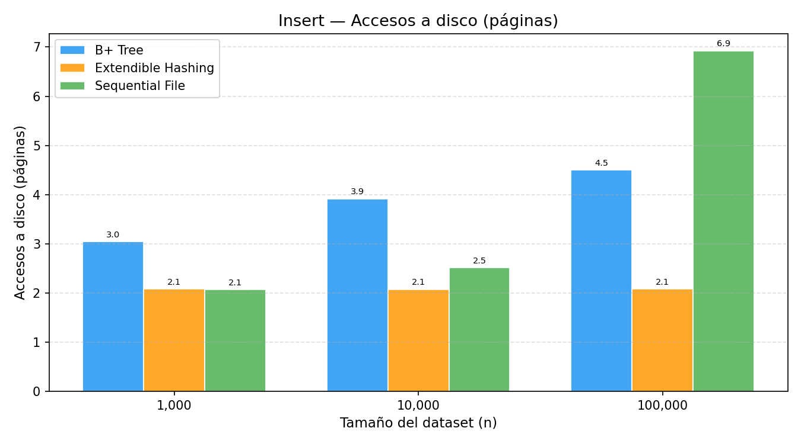

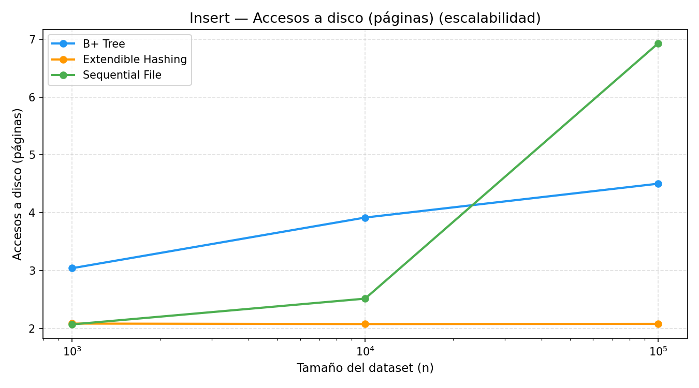

#### Tiempo de ejecución (ms)

| n | B+ Tree | Extendible Hashing | Sequential File |
|---|---|---|---|
| 1,000 | 0.03 | 0.01 | 0.02 |
| 10,000 | 0.03 | 0.01 | 0.14 |
| 100,000 | 0.04 | 0.01 | 2.78 |

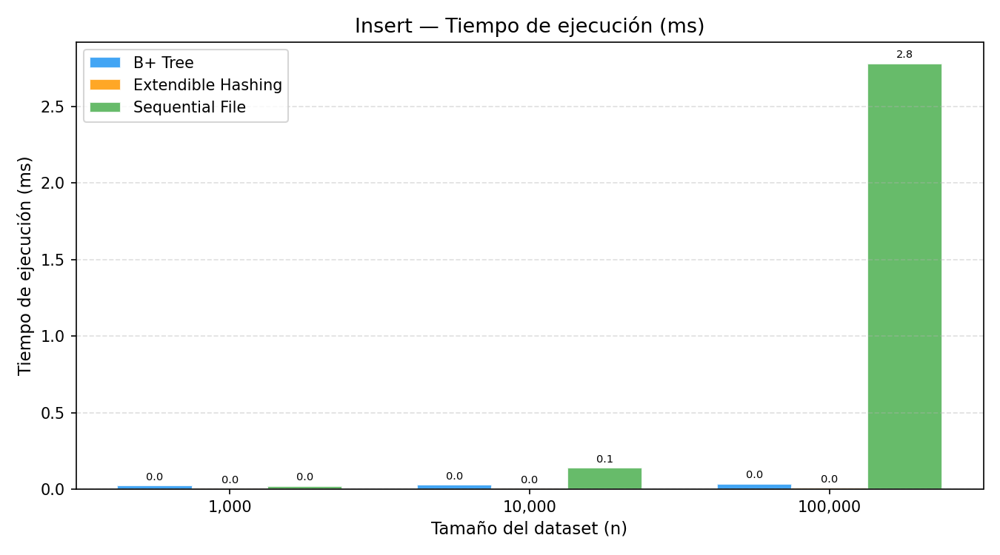

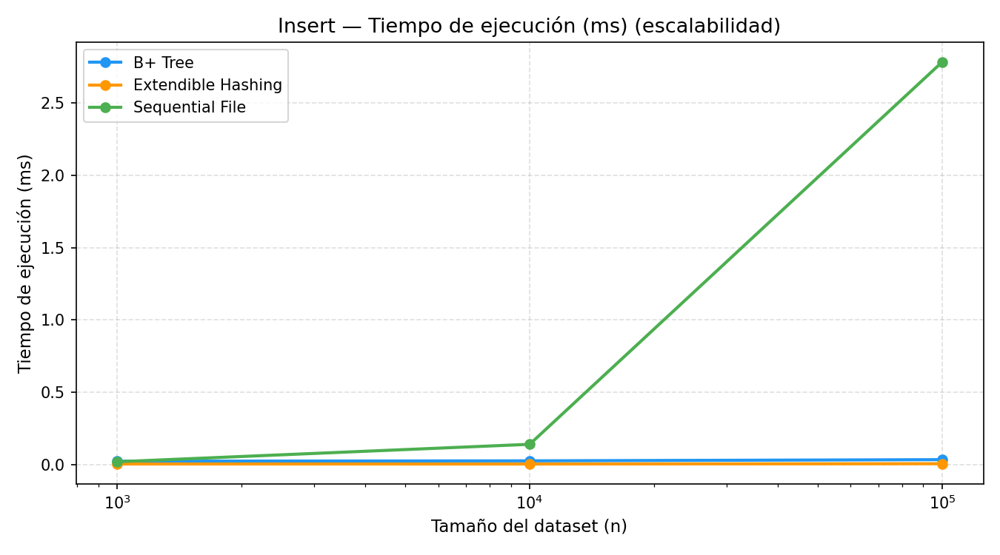

### 3.2 Search

#### Accesos a disco (páginas)

| n | B+ Tree | Extendible Hashing | Sequential File |
|---|---|---|---|
| 1,000 | 2.05 | 1.00 | 12.00 |
| 10,000 | 3.00 | 1.00 | 15.45 |
| 100,000 | 4.05 | 1.00 | 18.60 |

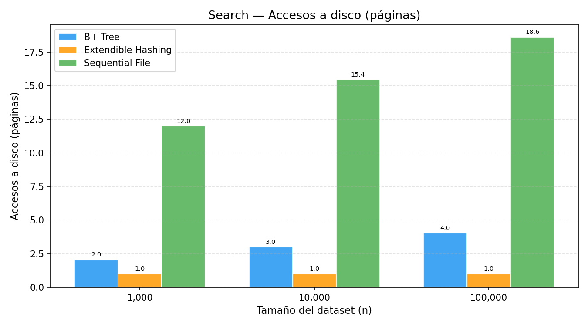

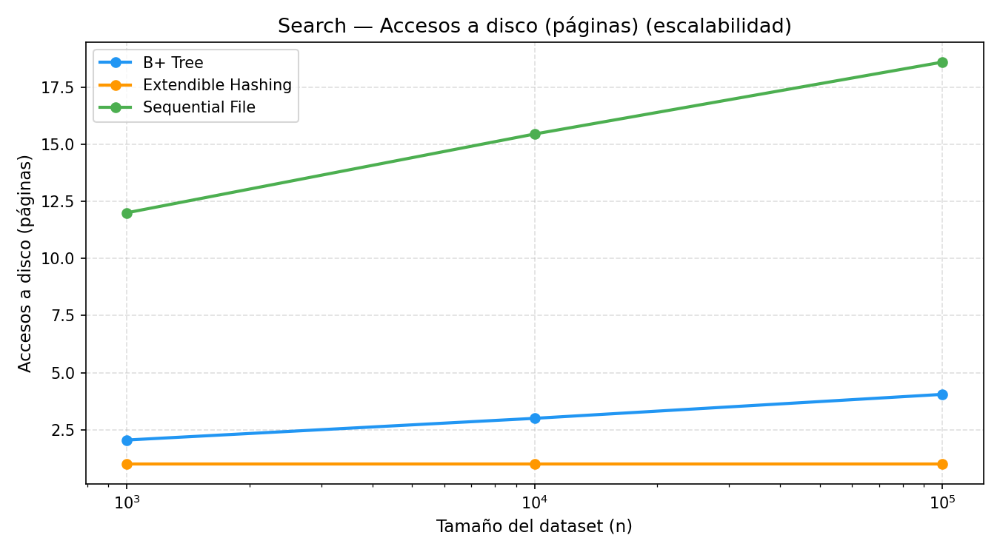

#### Tiempo de ejecución (ms)

| n | B+ Tree | Extendible Hashing | Sequential File |
|---|---|---|---|
| 1,000 | 0.02 | 0.02 | 0.03 |
| 10,000 | 0.02 | 0.02 | 0.04 |
| 100,000 | 0.03 | 0.02 | 0.06 |

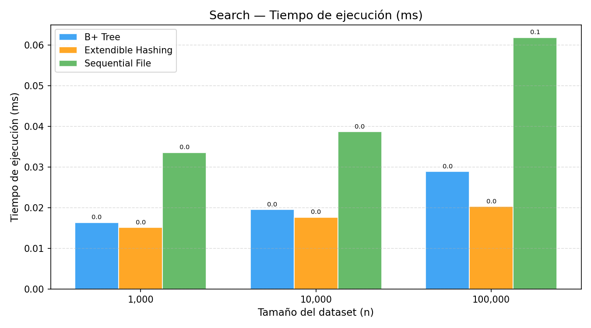

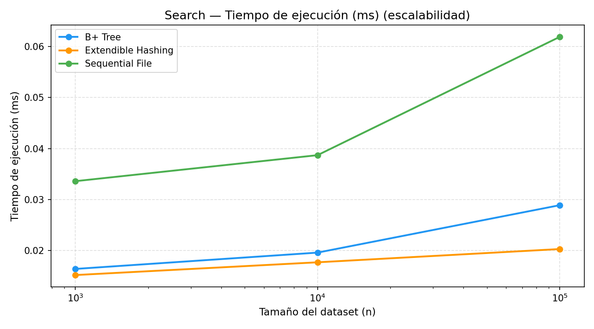

### 3.3 Range Search

#### Accesos a disco (páginas)

| n | B+ Tree | Extendible Hashing | Sequential File |
|---|---|---|---|
| 1,000 | 2.50 | — | 11.00 |
| 10,000 | 5.70 | — | 15.40 |
| 100,000 | 33.00 | — | 27.80 |

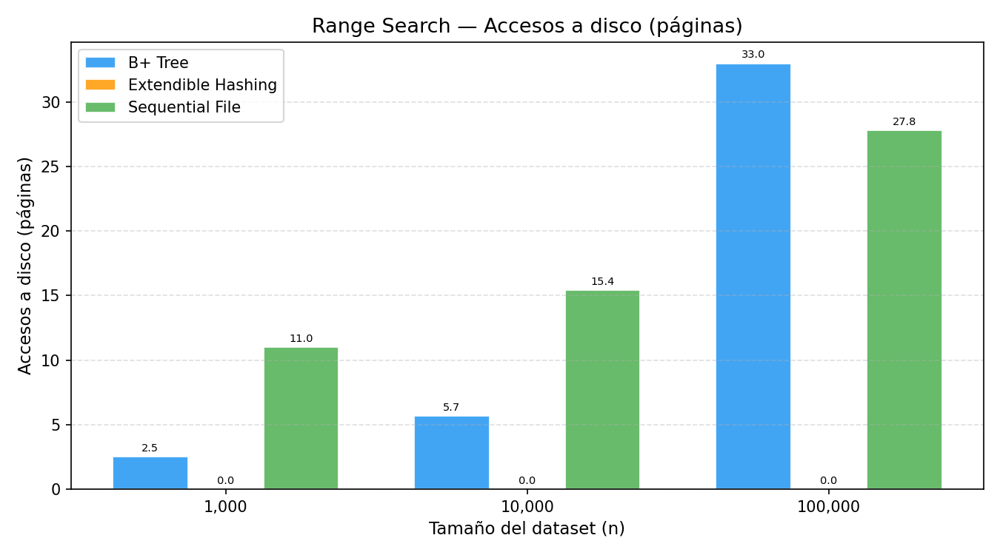

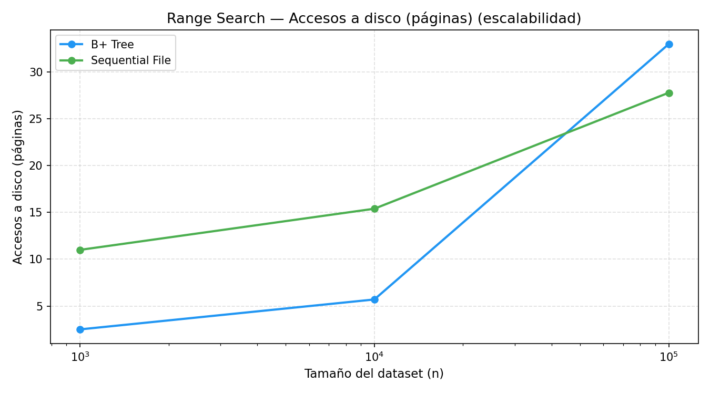

#### Tiempo de ejecución (ms)

| n | B+ Tree | Extendible Hashing | Sequential File |
|---|---|---|---|
| 1,000 | 0.02 | — | 0.04 |
| 10,000 | 0.04 | — | 0.09 |
| 100,000 | 0.28 | — | 0.65 |

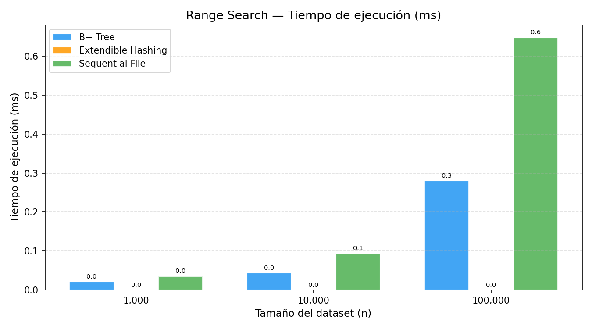

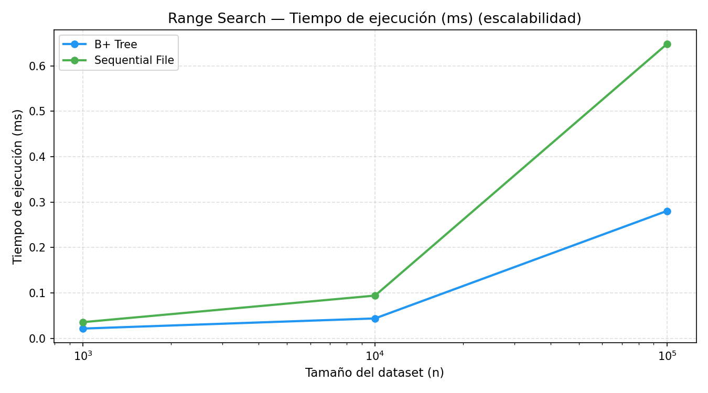

---

## 4. Discusión

### Insert

El Extendible Hashing es el más eficiente en inserción, con un costo prácticamente constante de ~2.1 páginas por operación independientemente del tamaño del dataset. Esto confirma el comportamiento O(1) amortizado: la gran mayoría de las inserciones se resuelven con una lectura de bucket y una escritura, y los splits son eventos poco frecuentes.

El B+ Tree crece de forma logarítmica: de 3.0 páginas en n=1,000 a 4.5 en n=100,000. Cada inserción navega desde la raíz hasta la hoja correspondiente, y el número de niveles aumenta lentamente con n, lo que explica el crecimiento suave.

El Sequential File muestra un comportamiento distinto: el costo promedio por inserción sube de 2.1 a 6.9 páginas al pasar de 1,000 a 100,000 registros. Esto se debe al rebuild periódico cada K=200 inserts: a medida que el archivo principal crece, cada reconstrucción lee y reescribe más páginas, elevando el promedio amortizado. Aun así, el costo sigue siendo bajo porque se reparte entre 200 operaciones.

### Search

El Hashing vuelve a destacar con una sola página leída en todos los casos, resultado directo de su acceso directo por clave sin necesidad de recorrer ninguna estructura.

El B+ Tree lee 2.0, 3.0 y 4.0 páginas para n=1,000, 10,000 y 100,000 respectivamente. La diferencia entre cada escala es de aproximadamente 1 página, consistente con el crecimiento logarítmico en base al orden del árbol.

El Sequential File lee 12.0, 15.4 y 18.6 páginas. La diferencia entre escalas es de ~3.3 páginas, exactamente log₂(10), lo que confirma que la búsqueda binaria implementada sobre el archivo principal funciona correctamente. El número de páginas leídas es mayor que el B+ Tree porque la búsqueda binaria opera sobre registros individuales y cada acceso puede caer en una página distinta, mientras que el B+ Tree navega por nodos internos compactos.

### Range Search

Este es el resultado más interesante del experimento. Para n=1,000 y n=10,000 el B+ Tree es más eficiente (2.5 y 5.7 páginas frente a 11.0 y 15.4 del Sequential). Sin embargo, para n=100,000 la situación se invierte: el Sequential File lee 27.8 páginas mientras el B+ Tree necesita 33.0.

La explicación es la localidad de acceso. El Sequential File almacena los registros ordenados en páginas contiguas en disco: una vez localizado el inicio con búsqueda binaria, el recorrido del rango lee páginas consecutivas, una por una. El B+ Tree, en cambio, recorre hojas enlazadas que pueden estar dispersas en el archivo, y además cada nodo interno recorrido durante la búsqueda inicial suma páginas adicionales. A mayor n, más niveles del árbol y más hojas en el rango, lo que hace crecer el costo más rápido.

El Extendible Hashing no soporta range search por diseño, ya que la función de hash destruye el orden de las claves.

### Tiempo de ejecución

Los tiempos siguen la misma tendencia que los accesos a disco, lo que confirma que el cuello de botella de todas las estructuras es el I/O a páginas. El Hashing es el más rápido en inserción y búsqueda puntual. El Sequential File es significativamente más lento en inserción a n=100,000 (2.78 ms/op frente a 0.04 del B+ Tree) debido al costo del rebuild, pero compite bien en búsqueda.

---

## 5. Conclusión

| Criterio | B+ Tree | Extendible Hashing | Sequential File |
|----------|---------|--------------------|-----------------|
| Insert | O(log n) | **O(1)** | O(1) amortizado |
| Search puntual | O(log n) | **O(1)** | O(log n) |
| Range search | O(log n + k) | ❌ No soportado | **O(log n + k)** |
| Localidad en rango | Media | — | **Alta** |
| Escalabilidad | Alta | Alta | Media |

El B+ Tree es la estructura más versátil: soporta búsqueda puntual y por rango con costo logarítmico garantizado, y escala bien a datasets grandes. Es la opción recomendada para cargas mixtas.

El Extendible Hashing domina en búsqueda puntual e inserción gracias a su acceso O(1), pero queda descartado cuando se necesita range search.

El Sequential File es competitivo en range search gracias a la localidad física de sus páginas: a n=100,000 supera al B+ Tree en accesos a disco. Su principal debilidad es el costo del rebuild periódico, que impacta el tiempo de inserción a escala.
